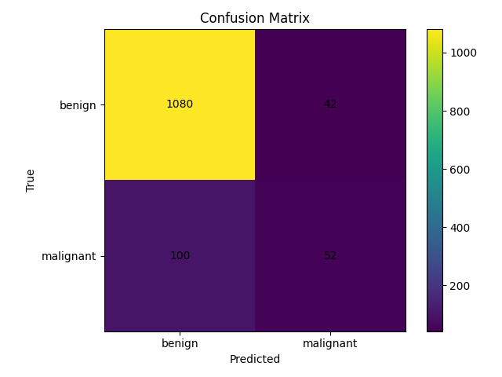
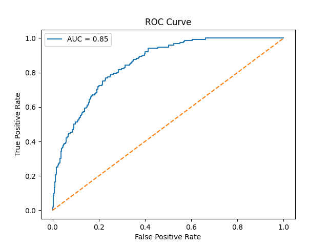
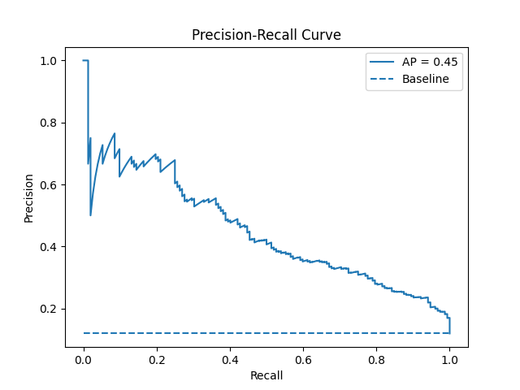
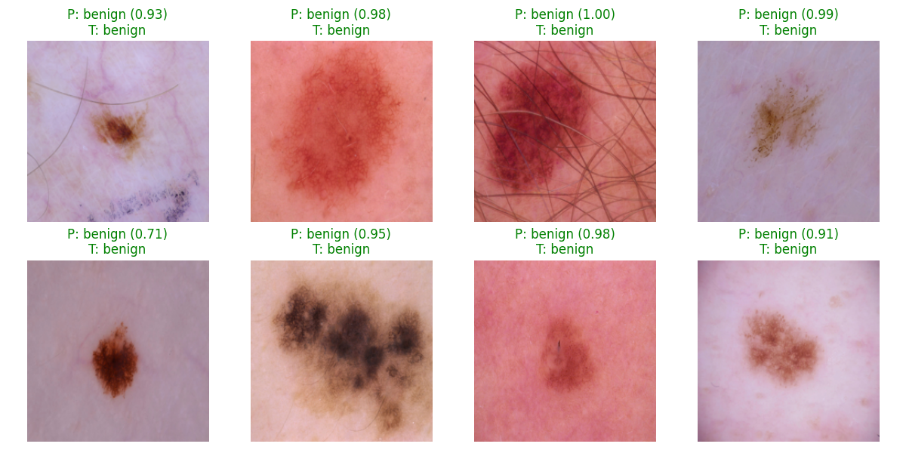
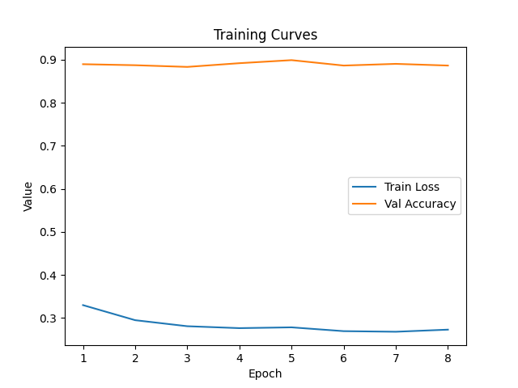

# Skin Cancer Classification with PyTorch

[](https://codecov.io/github/MarcoCrr/Skin-Cancer-Classifier)
[](https://github.com/MarcoCrr/Skin-Cancer-Classifier/actions)


An end-to-end deep learning project for binary skin cancer classification using the HAM10000 dataset and PyTorch.
The project emphasizes a clean architecture and contains model evaluation, visualization, and testing. Built also to take into account potential hardware memory constraints by selecting the dataset size and applying some data transformations.

## Features
### End-to-end ML pipeline:
* Data preparation
* Training
* Evaluation
* Visualization


### Evaluation:
* Precision / Recall
* Confusion Matrix
* ROC Curve
* Precision–Recall Curve

### Visualization tools:
* Predictions (with mistakes filtering)
* Training curves (loss & accuracy)


### Project Structure
```
.
├── configs/           # Configuration files
├── data/              # Dataset
├── logs/              # Outputs (plots, metrics)
├── models/            # Saved models
├── src/               # Source code
├── tests/             # Unit tests
├── README.md
```


## Examples: Results & Visualizations
**Notice**: this is a modest-sized project, whose goal is not to compete with more elaborate methods but rather to show how to set up a solid ML project, with good programming practices, et cetera. Its performance can be greatly improved with some tweaks and improvements (the number of false negatives is a perfect example of this).

### Confusion Matrix


### ROC Curve


### Precision-Recall Curve


### Predictions


### Training Curves



### Installation
Clone repository
```
git clone https://github.com/MarcoCrr/Skin-Cancer-Classifier.git
cd Skin-Cancer-Classifier
```

### Create environment (recommended)
```
conda create -n torch_env python=3.10
conda activate torch_env
```

### Install dependencies
Inside the active environment:
```
pip install -r requirements.txt
```

### Dataset

This project uses the HAM10000 dataset (skin lesion images).

Download with Kaggle:
```
kaggle datasets download -d kmader/skin-cancer-mnist-ham10000
unzip skin-cancer-mnist-ham10000.zip -d data/
```
... or manually from [this link](https://www.kaggle.com/datasets/kmader/skin-cancer-mnist-ham10000).


## Brief Tutorial
### Data Preparation

Prepare train/validation splits:

```
python -m src.prepare_data \
    --data_dir data \
    --output_dir data \
    --val_split 0.2 \
    --sample_size 2000
```
Training
```
python -m src.train --config configs/config.yaml
```

This will:

1. Train a ResNet18 model

2. Save the best model to _models/best_model.pth_

3. Log metrics to: _logs/train_log.txt_


### Evaluation
```
python -m src.evaluate
```

**Outputs:** precision / recall, confusion matrix, classification report

**Saved in:** _logs/eval.txt_

### Visualization
```
python -m src.visualize
```

Options:
```
--mistakes_only        # Show only incorrect predictions
--num_images           # Number of images to display
```


Generated plots saved in _logs/_:
```
training_curves.png
confusion_matrix.png
roc_curve.png
precision_recall_curve.png
predictions.png
```


### Testing

Run all tests:
```
pytest --cov=src
```

### Model Details
Architecture: ResNet18 <br>
Transfer learning (ImageNet pretrained) <br>
Final layer adapted for binary classification <br>